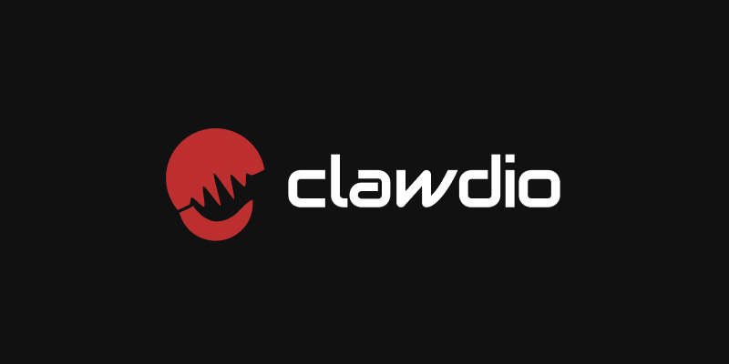

# Clawdio

An experimental project aimed to create modern effects for the Web Audio API using WASM and Rust.

We leverage the [Audio Worklet API](https://developer.mozilla.org/en-US/docs/Web/API/Web_Audio_API/Using_AudioWorklet) to offload audio processing to a separate thread, then use [WebAssembly (WASM)](https://webassembly.org/) to process the audio even faster using [Rust](https://www.rust-lang.org/).

This library includes a series of JavaScript modules you can include in your web audio projects to create different effects.

## Features

- Bitcrusher

## Getting Started

1. Install the library: `npm install clawdio`
1. Import the worklet for the effect you need and use it!: `import { createBitcrusherNode } from 'clawdio'`

Check the [example app](packages\examples\src\components\Bitcrusher\BitcrusherExample.tsx) on how to use each module. Documentation is coming soon!

### Using WASM directly

If you want greater control over the WASM, you can import each WASM module directly.

For example the Bitcrusher node would be: `yarn add clawdio-bitcrusher`

You can find an example of how to use it [in the library code](packages\clawdio\src\nodes\BitcrusherNode.ts).

## Development

This project includes both Typescript frontend code for each Audio Worklet, and corresponding WASM modules written in Rust.

### Requirements

- NodeJS
- [Rust](https://www.rust-lang.org/)
- [wasm-pack](https://github.com/rustwasm/wasm-pack)

### Overview

This library exports audio worklets to use in the Web Audio API.

**Rust WASM** modules go inside `/modules/` folder. Each module should be self-contained and able to build itself using `wasm-pack`. This is based off the [rust-wasm-library-template](https://github.com/whoisryosuke/rust-wasm-library-template).

**Frontend JS** code goes in `/packages/clawdio/src/` folder. Export any functions, components, etc using the `index.ts` file. This gets distributed to NPM. This based off [react-vite-library-boilerplate](https://github.com/whoisryosuke/react-vite-library-boilerplate).

> The library code is packaged together, but each WASM module is bundled and fetched individually to reduce the library size. You can also install each Rust module individually and use them directly if desired.

### Creating new worklet

You'll want to create a worklet first:

1. Start in the `src/workers/` and create an `AudioWorkletProcessor` for your effect. Ideally copy the existing template to support WASM initialization.
1. In the `process()` function of the `AudioWorkletProcessor`, you can run the Rust WASM module.

Then you can create a Rust WASM module that handles processing:

1. Create a new module inside `/modules/` folder, ideally just copy an existing effect.
1. Change the module name in the `Cargo.toml` to be `clawdio-youreffectname`.
1. Write any Rust code.
1. Build the modules: `yarn build:modules`
1. You should see a `/pkg` folder inside the `/modules/yourmodule/` with the WASM.
1. Install the Rust module as a dependency to the `clawdio` project. Use the `*` as version to ensure it sources locally.
1. Try using the Rust module in the frontend code.

### Building

1. Build WASM modules: `yarn build:modules`.
1. Build the library code: `yarn build`

### Release

1. Increment version in `package.json` of your module (aka `clawdio`, or a Rust module)
1. Commit the version change: `git commit -m ":bookmark: v4.2.0"`
1. Push your changes.
1. Tag the version change: `git tag v4.2.0`
1. Push the version change: `git push v4.2.0`
1. Go to GitHub and create a new release. Selec the tag you just created.

The build and release will automatically run once a release is created. You can track this in the GitHub Actions tab.

This publishes the main [`clawdio`](https://www.npmjs.com/package/clawdio) library, as well as all Rust WASM modules, to NPM.

> Working on a more automated system for this soon.

## References

- [Processing Web Audio with Rust and WASM](https://whoisryosuke.com/blog/2025/processing-web-audio-with-rust-and-wasm)
- [rust-wasm-library-template](https://github.com/whoisryosuke/rust-wasm-library-template)
- [react-vite-library-boilerplate](https://github.com/whoisryosuke/react-vite-library-boilerplate)
- [web-audio-sketchbook](https://github.com/whoisryosuke/web-audio-playground/)
