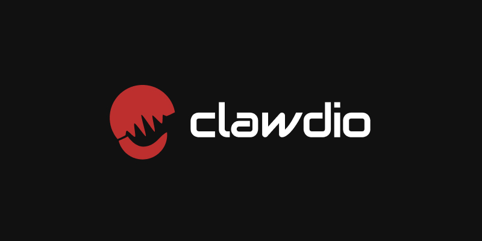

# Clawdio

An experimental library for creating modern audio effects for the Web Audio API using WASM and Rust.

- **[Documentation](https://whoisryosuke.github.io/clawdio/)**
- [Source code](https://github.com/whoisryosuke/clawdio)

> Looking for developer docs to spin this up locally? Check out the root README on GitHub.
