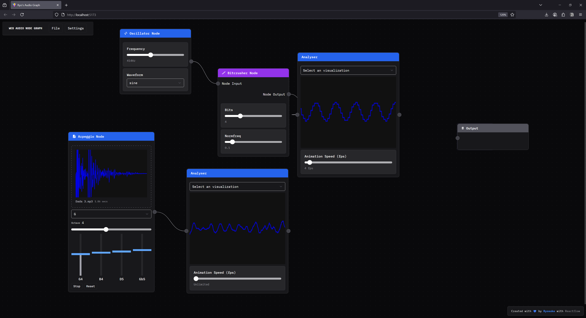

# Examples

Here are some examples to help you get started integrating clawdio with your app.

## <a href="https://github.com/whoisryosuke/clawdio/tree/main/packages/examples/" target="_blank">Example React App</a>

Check the example app in the project monorepo for <a href="https://github.com/whoisryosuke/clawdio/tree/main/packages/examples/src/components/" target="_blank">examples of each effect</a>.

It's a ReactJS app using Vite for bundling. The example app README should have details on how to spin it up for local development.

## <a href="https://github.com/whoisryosuke/web-audio-node-graph" target="_blank">Web Audio Node Graph</a>

I've put together an app that lets you connect web audio nodes in a big visual flow graph. It's a really useful tool for testing and visualizing each effect.

It has **clawdio** preinstalled and all the effects available as nodes.
