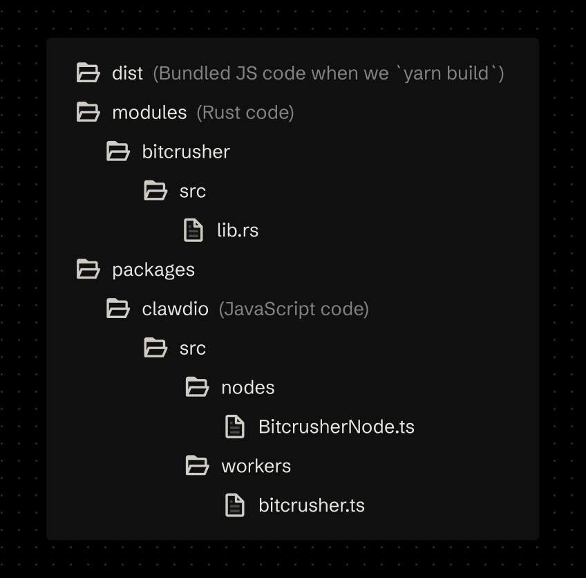

# How It Work(lets)

We use the [Web Audio API](https://developer.mozilla.org/en-US/docs/Web/API/Web_Audio_API) to create [Audio Worklets](https://developer.mozilla.org/en-US/docs/Web/API/AudioWorklet) that process your audio in a separate CPU thread, which increases performance. In the worklet we also leverage [Web Assembly (aka WASM)](https://webassembly.org/) to process the audio data using pre-compiled [Rust](https://www.rust-lang.org/) code.

You can chain these nodes into a Web Audio context, and they’ll handle the dirty work of initializing the WASM-based web worklets for you.

:::tip

You can read [a full breakdown on my blog here](https://whoisryosuke.com/blog/2025/web-audio-effect-library-with-rust-and-wasm) on how the library was created from the ground up.

:::

## High level architecture

Ultimately we need to ship Web Audio worklets written in JavaScript and WASM bundles to NPM. We have a folder dedicated to our Rust project. Then the frontend JavaScript code is a separate folder that relies on WASM generated by the Rust project.

Here’s the top level structure of the code:

When we want to write **Rust** code, we’ll do it inside `/modules/` folder. We’ll also create a separate folder for each WASM module so we can separate each module into it’s own WASM bundle, instead of having one big one to load all the effects.

The **JavaScript** code that gets released to NPM will be kept inside a `/packages/clawdio/src/` directory. We’ll have a folder dedicated to our “worklets” or `/workers/` and another folder called `/nodes/` to contain a convenient custom Audio Node that initializes the worklet properly for the user.

When we finally build our JS library, it’ll get placed inside a `/dist` folder that will be released to NPM.

## The flow

This is basically what happens from start to finish when a user creates a custom Clawdio node and then connects/chains it into their audio graph.

1. User runs our function to create a custom node (aka `createBitcrusherNode`)
1. WASM bundle is fetched (stored alongside the library)
1. Audio Worklet node is created
1. We send over the WASM as a buffer to the worklet via port messaging
1. The worklet initializes the WASM and stores the instance as a class property to use later.
1. We return the Audio Worklet node to user, as well as helpful setter functions for properties.
1. The user connects the node to their Web Audio context (like an oscillator node)
1. The worklet process the audio using WASM
1. User gets effected audio
